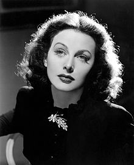

# `Contribucion de la Mujer a la Computacion`
## Hedy Lamarr

- Hedy Lamarr fue una actriz de cine e inventora austriaca, fue coinventora de la primera versión de las comunicaciones inalámbricas de largas distancias (WI-FI).
En 1997, Lamarr y George Antheil fueron honrados conjuntamente con el Premio Pioneer de la Electronic Frontier Foundation, Lamarr también fue la primera mujer en recibir el Premio BULBIE también conocido como el escor de la ivención.
- [Más sobre Hedy Lamarr](https://es.wikipedia.org/wiki/Hedy_Lamarr)

## Radia Joy Perlman

-  Radia Joy Es una creadora de software e ingeniera de redes, experta en seguridad. También conocida como la Madre de Internet actualmente trabaja para Dell. Anteriormente estuvo trabajando para Intel, para la que consiguió más de 47 patentes.
Es famosa por ser la creadora del protocolo Spanning Tree (STP), este protocolo es fundamental para permitir la redundancia de rutas en las redes de área local (LAN).

- [Más sobre Radia Joy Perlman](https://es.wikipedia.org/wiki/Radia_Perlman)

##
