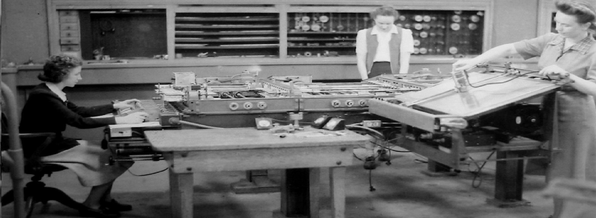

# `Contribucion de la Mujer a la Computacion`

La contribución de la mujer a la computación es mayor de lo que en realidad se conoce, fueron mujeres las que realizaron grandes descubrimientos que cambiarían nuestras vidas a nivel tecnológico, aqui hablatemos de alguna de ellas.

## Mujeres de la Computación
- [Hedy Lamarr](hedylamarr.md) 
- [Radia Joy Perlman](radiajoy.md)
- [Joan Clarke](joanclarke.md)
- [Grace Murray](gracemurray.md)

## Mujer de la computación Española
- [Nuria Oliver](nuriaoliver.md)

## Licencias

