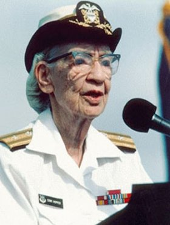

## Grace Murray

* Fue una científica de la computación. Entre las décadas de los 50 y 60 desarrolló el primer compilador para un lenguaje de programación, así como propició métodos de validación. 
* Popularizó la idea de los lenguajes de programación independientes de la máquina, lo que derivó en el desarrollo de COBOL, un lenguaje de alto nivel de programación que aún se utiliza.
*  Grace pensó que podía crearse un lenguaje de programación que usara órdenes en inglés y que sirviera para aplicaciones de negocios. Con esta idea, las bases para COBOL habían sido establecidas, y dos años después se creó el comité que diseñó este lenguaje.

# Premios
* Título de Hombre del año en ciencias de la computación en 1969.
* En 1991 recibio  Medalla nacional de tecnología.

# Curiosidad 
*El 28 de julio de 2020, la empresa Google Cloud anunció la construcción de un cable submarino de fibra óptica que une los Estados Unidos, el Reino Unido y España que lleva el nombre Grace Hopper en honor a la científica.

- [Más sobre Grace Murray](https://es.wikipedia.org/wiki/Grace_Murray_Hopper)
